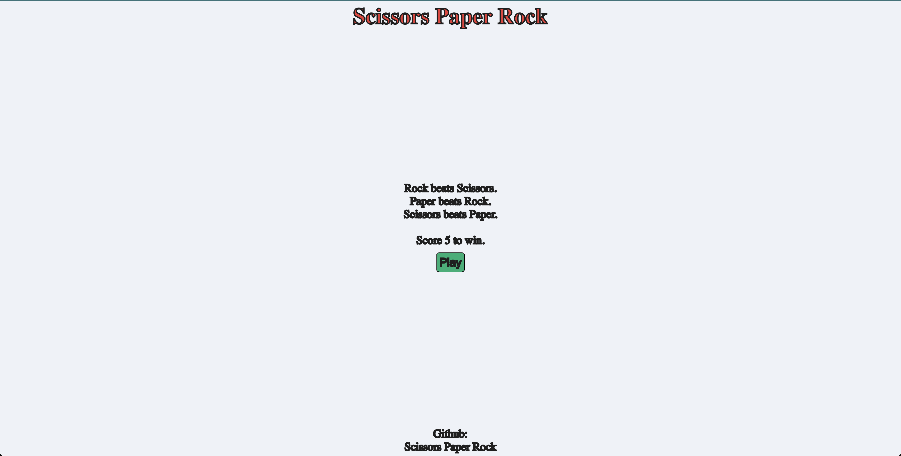

# Scissor Paper Rock

Scissor Paper Rock è una web app interattiva che permette di giocare a "Carta, Forbice, Sasso" contro il computer. Il gioco è stato realizzato come esercizio di JavaScript, HTML e CSS.

[👉 Prova il gioco online!](https://catellic.github.io/scissor-paper-rock/)

## Funzionalità

- Interfaccia semplice e responsiva
- Gioca contro il computer scegliendo tra forbici, carta o sasso
- Punteggio in tempo reale
- Messaggi di vittoria, sconfitta e pareggio
- Possibilità di rigiocare senza ricaricare la pagina

## Come iniziare

1. Clona questo repository o scarica i file.
2. Apri `index.html` con un browser moderno.
3. Clicca su "Play" e scegli la tua mossa!

## Struttura del progetto

- `index.html` — Pagina principale del gioco
- `style.css` — Stili CSS
- `script.js` — Logica del gioco
- `domSelectors.js` — Gestione selettori DOM
- `favicon_io/` — Icone del sito

## Screenshot

 <!-- Inserisci uno screenshot se disponibile -->

## Licenza

Questo progetto è open source e libero per uso personale o didattico.

---

Realizzato da catellic. Readme generato da Copilot.